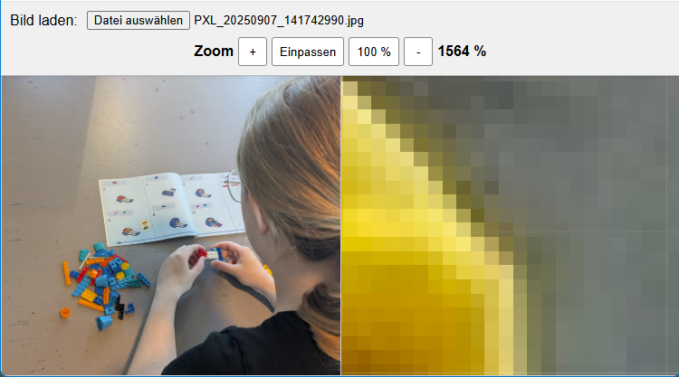

# &#128269; Zoomer

Ein Tool zum Zoomen in Raster- und Vektorgrafiken. 

## 🔍 Funktionen

- Laden von Raster- udn Vektorgrafiken
- Hinein- und Herauszoomen mittels Buttons

## 🖼️ Screenshot



## 🚀 Online ausprobieren

> Wird unterstützt durch **GitHub Pages**.

👉 [Hier klicken, um das Projekt direkt im Browser zu starten](https://tonitaste.github.io/Zoomer/)

## 📦 Installation (lokal)

Du kannst das Projekt lokal starten, indem du die Dateien einfach in einen Ordner speicherst und `index.html` in einem Browser öffnest:

```bash
git clone https://github.com/ToniTaste/Zoomer.git
cd Zoomer
# Dann: index.html im Browser öffnen
